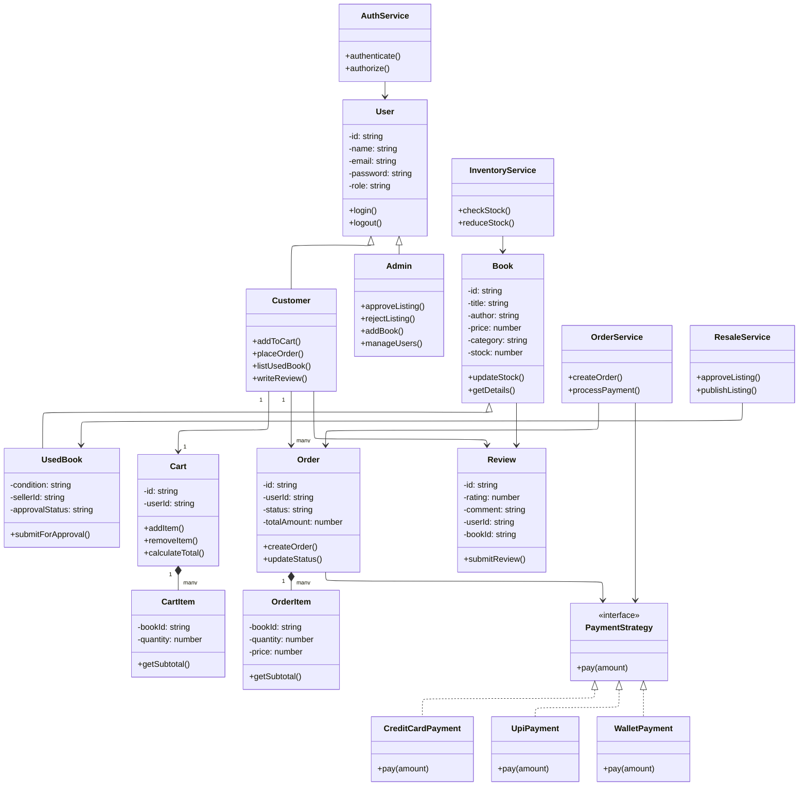

```mermaid
---
config:
  layout: elk
---
classDiagram

class User {
  -id: string
  -name: string
  -email: string
  -password: string
  -role: string
  +login()
  +logout()
}

class Customer {
  +addToCart()
  +placeOrder()
  +listUsedBook()
  +writeReview()
}

class Admin {
  +approveListing()
  +rejectListing()
  +addBook()
  +manageUsers()
}

User <|-- Customer
User <|-- Admin

class Book {
  -id: string
  -title: string
  -author: string
  -price: number
  -category: string
  -stock: number
  +updateStock()
  +getDetails()
}

class UsedBook {
  -condition: string
  -sellerId: string
  -approvalStatus: string
  +submitForApproval()
}

Book <|-- UsedBook

class Cart {
  -id: string
  -userId: string
  +addItem()
  +removeItem()
  +calculateTotal()
}

class CartItem {
  -bookId: string
  -quantity: number
  +getSubtotal()
}

Cart "1" *-- "many" CartItem
Customer "1" --> "1" Cart

class Order {
  -id: string
  -userId: string
  -status: string
  -totalAmount: number
  +createOrder()
  +updateStatus()
}

class OrderItem {
  -bookId: string
  -quantity: number
  -price: number
  +getSubtotal()
}

Order "1" *-- "many" OrderItem
Customer "1" --> "many" Order

class Review {
  -id: string
  -rating: number
  -comment: string
  -userId: string
  -bookId: string
  +submitReview()
}

Customer --> Review
Book --> Review

class PaymentStrategy {
  <<interface>>
  +pay(amount)
}

class CreditCardPayment {
  +pay(amount)
}

class UpiPayment {
  +pay(amount)
}

class WalletPayment {
  +pay(amount)
}

PaymentStrategy <|.. CreditCardPayment
PaymentStrategy <|.. UpiPayment
PaymentStrategy <|.. WalletPayment

Order --> PaymentStrategy

class AuthService {
  +authenticate()
  +authorize()
}

class OrderService {
  +createOrder()
  +processPayment()
}

class InventoryService {
  +checkStock()
  +reduceStock()
}

class ResaleService {
  +approveListing()
  +publishListing()
}

AuthService --> User
OrderService --> Order
OrderService --> PaymentStrategy
InventoryService --> Book
ResaleService --> UsedBook
```