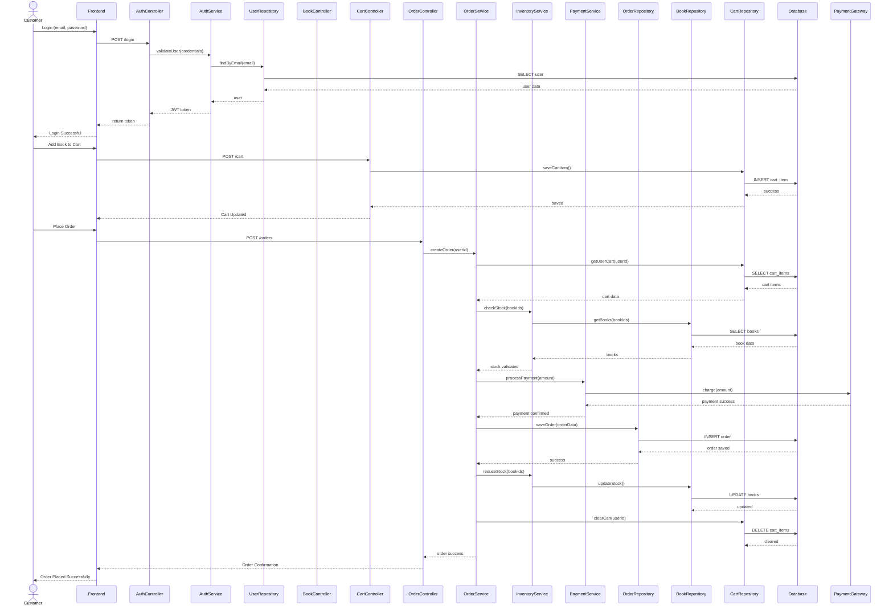

```mermaid
sequenceDiagram

%% =========================
%% ACTORS & SYSTEM LAYERS
%% =========================

actor Customer
participant Frontend
participant AuthController
participant AuthService
participant UserRepository
participant BookController
participant CartController
participant OrderController
participant OrderService
participant InventoryService
participant PaymentService
participant OrderRepository
participant BookRepository
participant CartRepository
participant Database
participant PaymentGateway

%% =========================
%% AUTHENTICATION FLOW
%% =========================

Customer->>Frontend: Login (email, password)
Frontend->>AuthController: POST /login
AuthController->>AuthService: validateUser(credentials)
AuthService->>UserRepository: findByEmail(email)
UserRepository->>Database: SELECT user
Database-->>UserRepository: user data
UserRepository-->>AuthService: user
AuthService-->>AuthController: JWT token
AuthController-->>Frontend: return token
Frontend-->>Customer: Login Successful

%% =========================
%% BROWSE & ADD TO CART
%% =========================

Customer->>Frontend: Add Book to Cart
Frontend->>CartController: POST /cart
CartController->>CartRepository: saveCartItem()
CartRepository->>Database: INSERT cart_item
Database-->>CartRepository: success
CartRepository-->>CartController: saved
CartController-->>Frontend: Cart Updated

%% =========================
%% PLACE ORDER FLOW
%% =========================

Customer->>Frontend: Place Order
Frontend->>OrderController: POST /orders

OrderController->>OrderService: createOrder(userId)

%% Validate Cart
OrderService->>CartRepository: getUserCart(userId)
CartRepository->>Database: SELECT cart_items
Database-->>CartRepository: cart items
CartRepository-->>OrderService: cart data

%% Check Inventory
OrderService->>InventoryService: checkStock(bookIds)
InventoryService->>BookRepository: getBooks(bookIds)
BookRepository->>Database: SELECT books
Database-->>BookRepository: book data
BookRepository-->>InventoryService: books
InventoryService-->>OrderService: stock validated

%% Process Payment
OrderService->>PaymentService: processPayment(amount)
PaymentService->>PaymentGateway: charge(amount)
PaymentGateway-->>PaymentService: payment success
PaymentService-->>OrderService: payment confirmed

%% Create Order Record
OrderService->>OrderRepository: saveOrder(orderData)
OrderRepository->>Database: INSERT order
Database-->>OrderRepository: order saved
OrderRepository-->>OrderService: success

%% Update Inventory
OrderService->>InventoryService: reduceStock(bookIds)
InventoryService->>BookRepository: updateStock()
BookRepository->>Database: UPDATE books
Database-->>BookRepository: updated

%% Clear Cart
OrderService->>CartRepository: clearCart(userId)
CartRepository->>Database: DELETE cart_items
Database-->>CartRepository: cleared

OrderService-->>OrderController: order success
OrderController-->>Frontend: Order Confirmation
Frontend-->>Customer: Order Placed Successfully
```