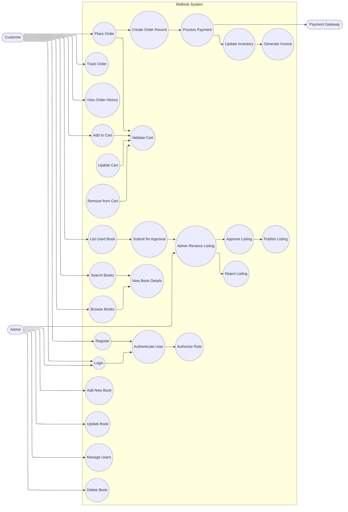

```mermaid
---
config:
  layout: elk
---
flowchart LR
Customer([Customer])
Admin([Admin])
PaymentGateway([Payment Gateway])
subgraph ReBook System
Register((Register))
Login((Login))
Authenticate((Authenticate User))
Authorize((Authorize Role))

Register --> Authenticate
Login --> Authenticate
Authenticate --> Authorize
Browse((Browse Books))
Search((Search Books))
ViewDetails((View Book Details))

Browse --> ViewDetails
Search --> ViewDetails
AddCart((Add to Cart))
UpdateCart((Update Cart))
RemoveCart((Remove from Cart))
ValidateCart((Validate Cart))

AddCart --> ValidateCart
UpdateCart --> ValidateCart
RemoveCart --> ValidateCart
PlaceOrder((Place Order))
CreateOrder((Create Order Record))
ProcessPayment((Process Payment))
UpdateInventory((Update Inventory))
GenerateInvoice((Generate Invoice))
TrackOrder((Track Order))
ViewHistory((View Order History))

PlaceOrder --> ValidateCart
PlaceOrder --> CreateOrder
CreateOrder --> ProcessPayment
ProcessPayment --> UpdateInventory
UpdateInventory --> GenerateInvoice
ListUsed((List Used Book))
SubmitApproval((Submit for Approval))
AdminReview((Admin Reviews Listing))
Approve((Approve Listing))
Reject((Reject Listing))
PublishListing((Publish Listing))

ListUsed --> SubmitApproval
SubmitApproval --> AdminReview
AdminReview --> Approve
AdminReview --> Reject
Approve --> PublishListing
AddBook((Add New Book))
UpdateBook((Update Book))
DeleteBook((Delete Book))
ManageUsers((Manage Users))

end

Customer --> Register
Customer --> Login
Customer --> Browse
Customer --> Search
Customer --> AddCart
Customer --> PlaceOrder
Customer --> TrackOrder
Customer --> ViewHistory
Customer --> ListUsed

Admin --> Login
Admin --> AdminReview
Admin --> AddBook
Admin --> UpdateBook
Admin --> DeleteBook
Admin --> ManageUsers

ProcessPayment --> PaymentGateway
```